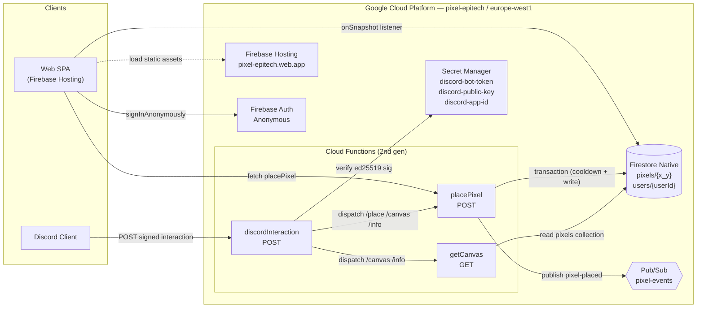
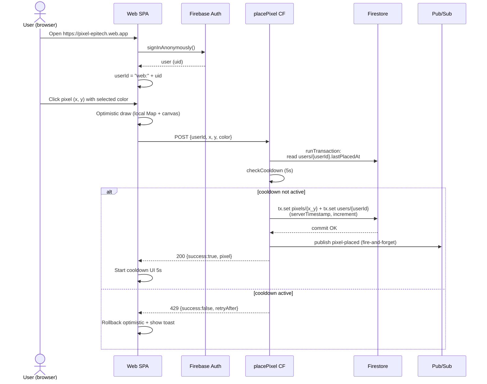
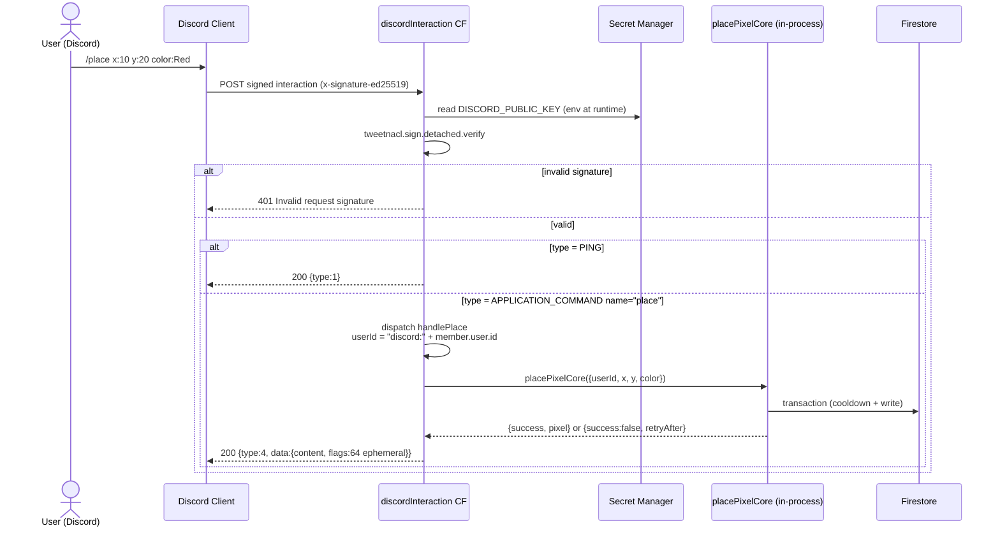
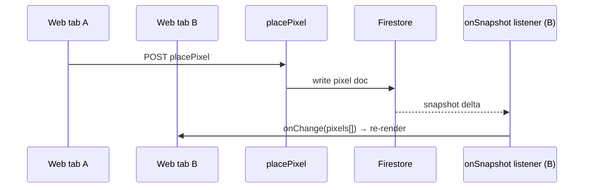

# PixelBoard — Architecture

100% serverless collaborative pixel canvas on Google Cloud Platform, exposed through both a Discord bot and a web SPA. Inspired by Reddit r/place.

## High-level overview



## Components

| Component | Role | GCP Service | Region |
|-----------|------|-------------|--------|
| **placePixel** | Validates input, checks cooldown, atomically writes pixel + updates user via Firestore transaction, fire-and-forget Pub/Sub publish | Cloud Functions 2nd gen (Node.js 20) | europe-west1 |
| **getCanvas** | Reads all docs from `pixels` collection and returns `{pixels, width, height, palette}` | Cloud Functions 2nd gen | europe-west1 |
| **discordInteraction** | Verifies Discord ed25519 signature, dispatches `/place` `/canvas` `/info` to internal handlers (no HTTP roundtrip — direct function call to placePixelCore / getCanvasCore) | Cloud Functions 2nd gen, secret-bound to `discord-public-key` | europe-west1 |
| **Firestore Native** | `pixels/{x}_{y}` documents (1 doc per pixel) and `users/{userId}` documents (cooldown + counter). Public read on `pixels` and `canvas`, deny writes (backend-only via Admin SDK) | Firestore Native | europe-west1 |
| **Pub/Sub** | Topic `pixel-events`, currently fire-and-forget after each placement (consumer reserved for Phase 5 real-time fan-out) | Pub/Sub | global |
| **Secret Manager** | Stores Discord bot token, public key (signature verification), app ID. IAM binding: `secretmanager.secretAccessor` to the Cloud Functions runtime SA | Secret Manager | global |
| **Firebase Hosting** | Static SPA (HTML, CSS, ESM JS) served from `pixel-epitech.web.app` | Firebase Hosting | global edge |
| **Firebase Auth** | Anonymous sign-in only (Phase 4 scope decision — Google login deferred) | Firebase Auth | global |

## Data model

### Firestore collections

```
pixels/
  ${x}_${y}                    // doc id = "10_20"
    x: number (0-99)
    y: number (0-99)
    color: string ("#XXXXXX")  // member of the 16-color palette
    userId: string             // "web:<firebaseUid>" or "discord:<snowflake>"
    placedAt: Timestamp        // FieldValue.serverTimestamp()

users/
  ${userId}                    // doc id = "discord:12345" or "web:abc123"
    lastPlacedAt: Timestamp    // updated atomically with each pixel placement
    placedCount: number        // incremented atomically

canvas/
  main                         // metadata doc (currently unused in logic, reserved for multi-canvas)
    width: 100
    height: 100
    palette: [16 hex strings]
```

**Why 1 doc/pixel (not a single canvas doc)** :
- Concurrent writes never conflict (each pixel is an isolated document — `set()` on different doc IDs is collision-free)
- Last-write-wins on the same `(x,y)` is naturally provided by Firestore `set()` without `{merge:true}`
- Doc size stays tiny (~80 bytes), well under the 1 MiB limit
- Real-time listener can target the whole `pixels` collection or filtered subsets (Phase 4 uses `onSnapshot(collection(db, "pixels"))`)

**Why a single canvas doc was rejected**:
- 10k pixels × ~80B ≈ 800 KiB — leaves no room to grow
- Every placement would rewrite the whole document → contention
- A real-time listener would receive the full payload on every change

## Key flows

### Place a pixel via web



### Place a pixel via Discord



### Real-time canvas update



## Security

| Layer | Mechanism |
|-------|-----------|
| **Cloud Functions auth** | `roles/run.invoker` on `allUsers` (public endpoints) — placePixel, getCanvas, discordInteraction. Discord endpoint protected by ed25519 signature check at the application layer |
| **Discord** | ed25519 signature verification on every request using `discord-public-key` from Secret Manager. Invalid signature → 401 |
| **Firestore client access** | `firestore.rules`: `pixels` and `canvas` are publicly readable, `users` requires `request.auth.uid == userId`, all collection writes from clients are denied (`allow write: if false`). Backend writes via Admin SDK bypass rules. |
| **Cloud Functions secrets** | `discord-public-key` bound at deploy time via `defineSecret()`. Runtime SA (`<projectNumber>-compute@developer.gserviceaccount.com`) has `roles/secretmanager.secretAccessor` on each secret. |
| **Input validation** | Strict integer check on `x`/`y` (rejects strings, floats), bounds check `0 <= x,y <= 99`, color must be a member of the 16-color palette (canonicalized to uppercase) |
| **Rate limiting** | Firestore transaction reads `users/{userId}.lastPlacedAt`, rejects if `now - lastPlacedAt < 5s`. Atomicity guarantees no double-placement on rapid clicks. |
| **No secrets in code** | All sensitive values in Secret Manager (Discord). Firebase Web config (apiKey, projectId, …) is public per Firebase design and committed in `firebase-config.js`. |

### Known accepted debt (school project context)

- No App Check or per-IP rate limit — bot endpoints are publicly invokable. Mitigated by cooldown rate-limit per userId (which becomes trivial to bypass without auth — Phase 6 of the original roadmap intended to add Firebase Auth verification on `placePixel` to lock userIds to `request.auth.uid`).
- Pub/Sub publish is fire-and-forget without an outbox/retry — message loss possible if publish fails after Firestore write. Currently no consumer for `pixel-events` so impact is zero.
- Firebase JS SDK loaded from gstatic.com CDN — depends on third-party CDN availability.

## Scalability characteristics

| Dimension | Capacity | Bottleneck |
|-----------|----------|------------|
| Concurrent placements | ~500 writes/s burst (Firestore quota), 10 writes/s sustained on free tier | Firestore writes |
| Read load | Firestore real-time listeners scale to thousands of clients per project | Firestore reads (free tier 50k/day) |
| Cloud Functions concurrency | 2nd gen scales horizontally to 1000 concurrent instances by default | Cold-start latency on first request after idle |
| Storage | 100×100 = 10k pixel docs ≈ 800 KiB total | Negligible |
| Discord bot throughput | Limited by Discord interaction timeout (3s) — placePixelCore P50 ≈ 200ms in-process, well within budget | Discord-side rate limits |

## Repository layout

```
functions/                  # Cloud Functions backend
├── index.js                # Exports placePixel, getCanvas, discordInteraction
├── package.json
├── constants.json          # (auto-generated, gitignored) copy of shared/constants.json bundled at deploy
├── src/
│   ├── pixel/
│   │   ├── placePixel.js   # placePixelCore + HTTP wrapper
│   │   └── getCanvas.js    # getCanvasCore + getUserStats + HTTP wrapper
│   ├── discord/
│   │   ├── discordInteraction.js  # entry point (signature check + dispatch)
│   │   ├── handlers.js     # /place, /canvas, /info command handlers
│   │   └── signature.js    # ed25519 verification
│   └── shared/
│       ├── config.js       # exports CANVAS_WIDTH, PALETTE, COOLDOWN_SECONDS, COLLECTIONS
│       ├── firestore.js    # Firestore Admin SDK singleton + ref helpers
│       ├── auth.js         # auth stub (extensible for Phase 6)
│       ├── rateLimit.js    # checkCooldown
│       ├── validation.js   # validateCoordinates, validateColor
│       └── pubsub.js       # publishPixelEvent
└── __tests__/              # Jest, 64 tests, 90%+ coverage

web/public/                 # Firebase Hosting SPA
├── index.html              # canvas + palette + user info
├── style.css               # dark theme
├── constants.js            # (auto-generated) globals from shared/constants.json
├── firebase-config.js      # Firebase Web SDK config (public)
├── firebase-init.js        # init app + auth + firestore
├── api.js                  # placePixel / getCanvas fetch wrappers
├── realtime.js             # onSnapshot listener
├── canvas.js               # rendering helpers
├── zoom-pan.js             # wheel zoom + shift+drag pan
└── app.js                  # entry point + state + handlers

scripts/
├── setup-gcp.sh            # enable APIs, create Firestore + Pub/Sub topic
├── setup-discord.sh        # guide for Discord app creation
├── register-commands.js    # registers /place /canvas /info via Discord REST
├── deploy.sh               # npm ci + sync-config + firebase deploy
├── sync-config.sh          # wrapper for sync-config-gen.js
└── sync-config-gen.js      # generates web/public/constants.js + functions/constants.json from shared/constants.json

shared/
└── constants.json          # single source of truth for canvas size, palette, cooldown

docs/
├── ARCHITECTURE.md         # this file
├── API.md                  # endpoint reference
├── SETUP_GUIDE.md          # zero-to-deploy guide
└── DEMO.md                 # demo script

firebase.json               # Hosting + Functions + Firestore config
firestore.rules             # security rules (deny client writes)
firestore.indexes.json      # composite indexes (currently none)
.firebaserc                 # project alias
```
