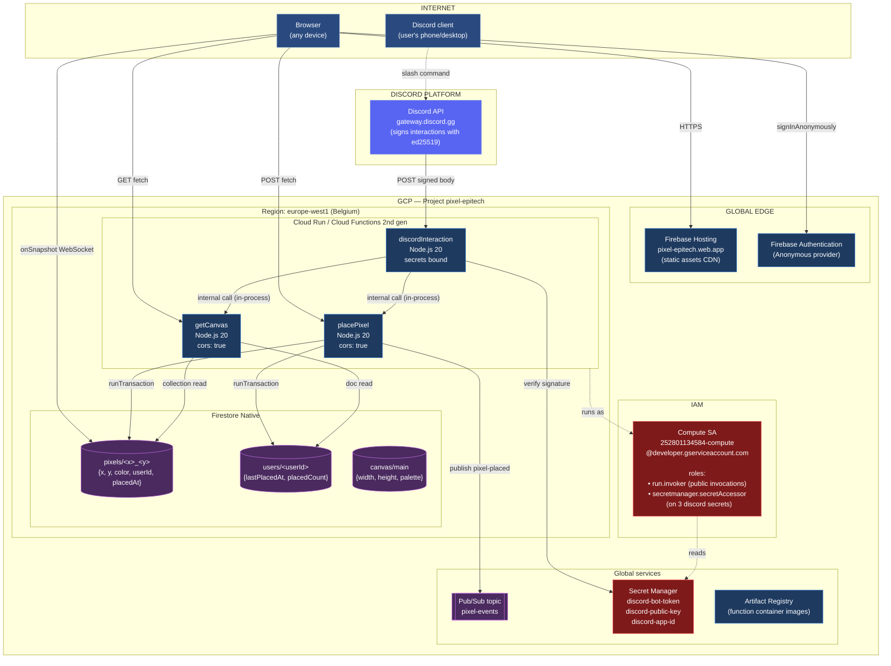
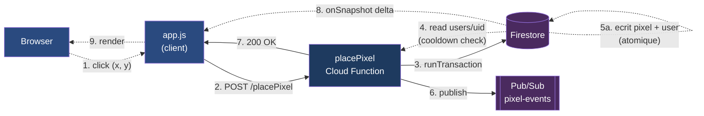
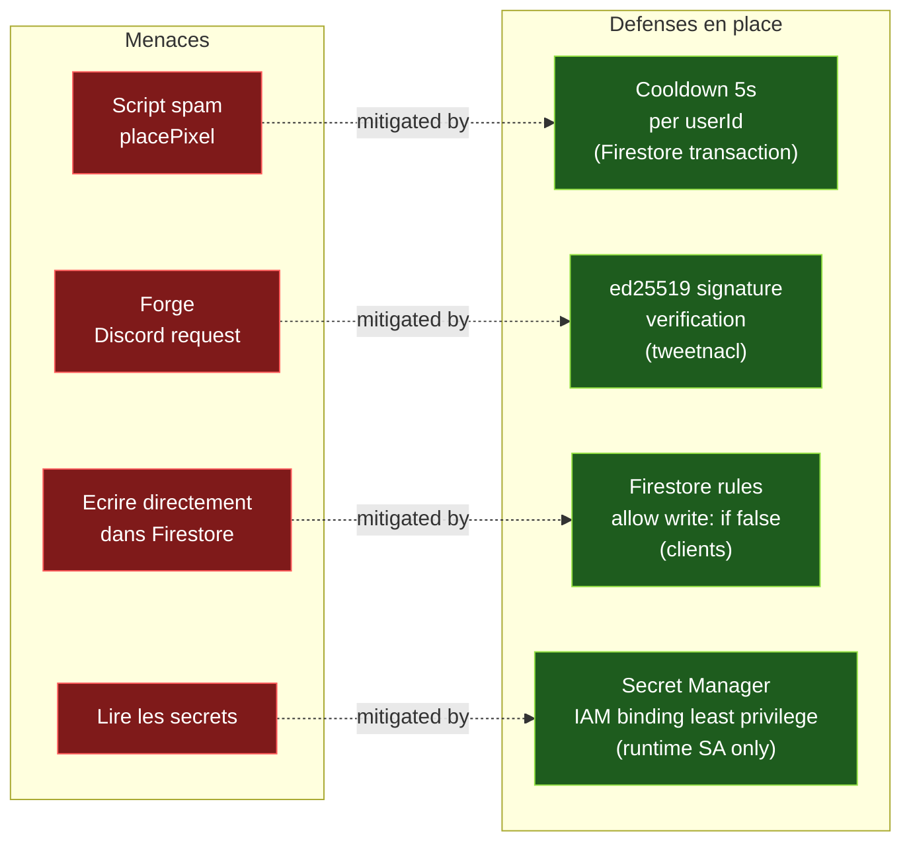

# PixelBoard — Schema d'infrastructure

## Vue d'ensemble (all services, deployed in `pixel-epitech` / `europe-west1`)



---

## Data flow — placement d'un pixel



---

## Surface d'attaque et controles



---

## ASCII fallback (pour pdf / slide simple)

```
┌─────────────────────────────────────────────────────────────────────┐
│                               INTERNET                              │
│   ┌─────────────┐                              ┌──────────────┐     │
│   │   Browser   │                              │ Discord user │     │
│   └──────┬──────┘                              └───────┬──────┘     │
└──────────│─────────────────────────────────────────────│────────────┘
           │                                             │
           │                                   ┌─────────▼─────────┐
           │                                   │   Discord API     │
           │                                   │ (signs ed25519)   │
           │                                   └─────────┬─────────┘
           │                                             │
┌──────────│─────────────────────────────────────────────│────────────┐
│          │                GCP — pixel-epitech          │            │
│          │                                             │            │
│  ┌───────▼────────┐  ┌─────────────┐           ┌───────▼─────────┐  │
│  │ Firebase       │  │  Firebase   │           │ discordInterac- │  │
│  │ Hosting        │  │  Auth       │           │ tion (CF2)      │  │
│  │ (static SPA)   │  │  Anonymous  │           └───┬─────────────┘  │
│  └────────────────┘  └─────────────┘               │                │
│          │                  │                      │                │
│          │ POST fetch       │                      │ in-process     │
│          │                  │                      │ call           │
│          ▼                  │                      ▼                │
│  ┌────────────────┐         │          ┌──────────────────────┐     │
│  │ placePixel CF  │◄────────────────── │ placePixelCore       │     │
│  │ (europe-west1) │         │          │ getCanvasCore        │     │
│  └────┬───────────┘         │          └──────────────────────┘     │
│       │                     │                                       │
│       │ GET fetch           │                                       │
│       │                     │                                       │
│  ┌────▼───────────┐         │                                       │
│  │ getCanvas CF   │         │                                       │
│  └────┬───────────┘         │                                       │
│       │                     │                                       │
│       ▼                     ▼                                       │
│  ┌────────────────────────────────┐      ┌────────────────────────┐ │
│  │     Firestore Native           │      │  Secret Manager        │ │
│  │  ─ pixels/<x>_<y>              │      │  ─ discord-bot-token   │ │
│  │  ─ users/<userId>              │      │  ─ discord-public-key  │ │
│  │  ─ canvas/main                 │      │  ─ discord-app-id      │ │
│  │  (europe-west1, Native mode)   │      └────────────────────────┘ │
│  └─────────┬──────────────────────┘                                 │
│            │                                                        │
│            │ onSnapshot (WebSocket to browser)                      │
│            │                                                        │
│            └──────────► back to Browser for real-time UI update     │
│                                                                     │
│  ┌────────────────────────────┐                                     │
│  │  Pub/Sub topic             │ ◄── publish pixel-placed after      │
│  │  pixel-events              │     Firestore commit (fire-and-     │
│  │  (global)                  │     forget, reserved for Phase 5)   │
│  └────────────────────────────┘                                     │
│                                                                     │
│  IAM: compute SA has run.invoker (public) +                         │
│       secretmanager.secretAccessor on 3 Discord secrets only        │
└─────────────────────────────────────────────────────────────────────┘
```

---

## Legende

| Couleur Mermaid | Signification |
|-----------------|---------------|
| 🔵 Bleu clair | Clients / clients externes (browser, Discord user) |
| 🔵 Bleu fonce | Cloud Functions + services compute GCP |
| 🟣 Violet | Stockage (Firestore, Pub/Sub) |
| 🔴 Rouge | Surface menaces / Secret Manager / IAM |
| 🟢 Vert | Defenses / controles de securite |

## Services actives (inventaire GCP)

```
APIs enabled (gcloud services list --enabled) :
  cloudfunctions.googleapis.com    Cloud Functions
  run.googleapis.com               Cloud Run (backs 2nd gen functions)
  cloudbuild.googleapis.com        Build container images
  artifactregistry.googleapis.com  Store container images
  firestore.googleapis.com         Firestore Native
  pubsub.googleapis.com            Pub/Sub messaging
  secretmanager.googleapis.com     Secret storage
  eventarc.googleapis.com          Event routing (Phase 5 ready)
  firebaserules.googleapis.com     Firestore security rules
  iam.googleapis.com               Identity & access
  cloudresourcemanager.googleapis.com   Project metadata
  iamcredentials.googleapis.com    SA token generation
  logging.googleapis.com           Cloud Logging (default)
  monitoring.googleapis.com        Cloud Monitoring (default)

Resources created :
  Firestore database (default)     mode NATIVE, location europe-west1
  Pub/Sub topic                    pixel-events
  Secret Manager                   discord-bot-token, discord-public-key, discord-app-id
  Cloud Functions 2nd gen          placePixel, getCanvas, discordInteraction (europe-west1)
  Firebase Hosting site            pixel-epitech.web.app
  Firebase Auth                    Anonymous provider enabled
  Firebase Web App                 1:252801134584:web:c072e3401cf0e85358300d
```

---

## Rendu visuel

Pour voir les diagrammes Mermaid rendus :

1. **GitHub** — ouvre ce fichier directement sur github.com, Mermaid est rendu nativement dans l'apercu Markdown
2. **VS Code** — extension "Markdown Preview Mermaid Support" (bierner.markdown-mermaid)
3. **En ligne** — https://mermaid.live/ — colle n'importe lequel des blocs mermaid ci-dessus
4. **Export PNG/SVG** — https://mermaid.live → Actions → Download PNG ou SVG pour un slide
